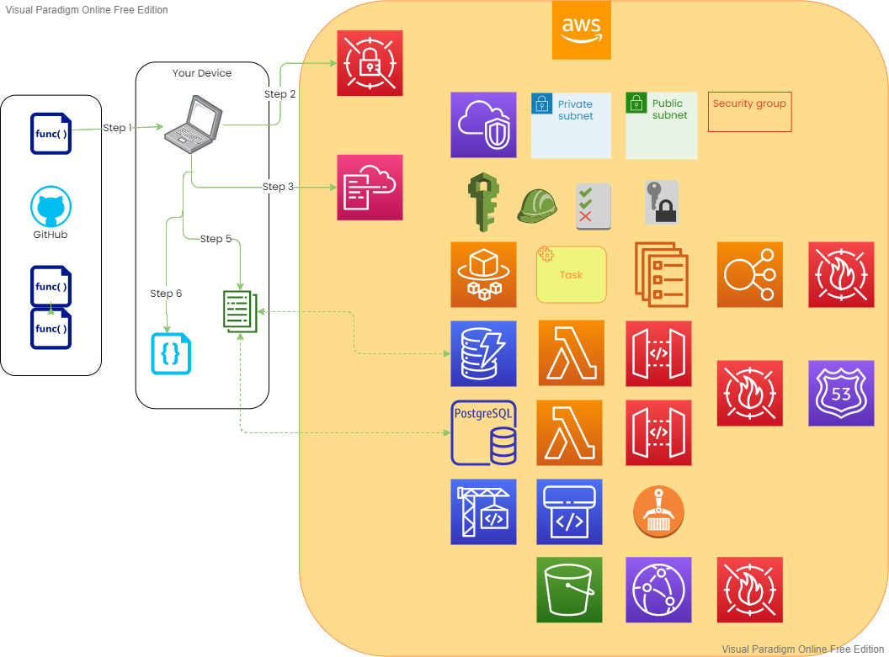

# NHS Business Intelligence Platform

Cloud deployment of a Business Intelligence Application Suite, including modules for Population Health Management

## Overview

The Digital Intelligence Unit @ NHS Blackpool CCG have created a cloud-deployed Business Intelligence application suite with a primary focus on Population Health Management. We have developed this as a small team and this is currently being utilised by Public Sector staff across Lancashire & South Cumbria. Information on our deployment of the platform can be found at the following links:

- <https://aws.amazon.com/blogs/publicsector/one-small-team-created-cloud-based-predictive-modeling-solution-improve-healthcare-services-uk/>
- <https://www.nexusintelligencenw.nhs.uk> (Login required)

We have built this platform entirely on open-source technology so there is absolutely no licence costs for using it, only running costs which vary depending on usage.

Given the advances we have been able to make by using open-source technology, we have decided to open-source our code in order for others to benefit. We have migrated from closed git repositories to public Github and welcome others to collaborate, contribute and use for the benefit of public service.

We will be actively maintaining these repositories, so if you identify an issue or would like new functionality please feel free to create an issue in Github or message a contributor directly.

## Architecture

## Other Repositories included as part of deployment

- Web Application: <https://github.com/morgans3/NHS_Business_Intelligence_Platform_App>
- API Server: <https://github.com/morgans3/NHS_Business_Intelligence_Platform_Api>
- Open Trip Planner Server: <https://github.com/morgans3/NHS_Business_Intelligence_Platform_Otp>
- Cross-Filter Server: <https://github.com/morgans3/NHS_Business_Intelligence_Platform_CF-Api>

## Pre-requisites

- An AWS Account, with an IAM with required permissions to use CDK
- Locally stored AWS Credentials which grant programmatic access, created in AWS IAM
- Typescript v2.7 or later installed
- Node.js v10.13.0 or later installed

## Deployment Steps

### Step One - Setup Local Environment

- Download this repository to your local machine
- run the command `npm i` to install the node_modules folder and libraries
- In the terminal, run `npm run watch` to watch and compile changes
- Update lib/\_config.ts file to customise the configuration or add new files to the Stack

### Step Two - Generate Secrets

- Run the command `npm run generate-secrets` to add the required secrets and passwords to your AWS Secrets Manager

### Step Three - Setup AWS Cloudformation

- Run `cdk bootstrap` to bootstrap your AWS account
- Run `cdk bootstrap --app "node bin/globalcdk.js"` to bootstrap the global region in your AWS account

### Step Four - Deploy Infrastructure

- Run `cdk deploy --app "node bin/globalcdk.js" --all` to deploy all the global resources, like the Cloudfront Firewall
- Run `cdk deploy --all` to deploy all the regional resources

### Step Five - Deploy Datasets

- Run the command `npm run deploy-data` to save the initial datasets to the newly deployed cloud databases.

### Step Six - Test Deployment

- Run the command `npm run test-deployment` to start the automated test scripts. This will run through a series of tests to ensure all services are operational.

## Resources Deployed

Once fully deployed, you will have the following AWS resources in your AWS account:

- AWS Secret's Manager with secrets & passwords for your platform to operate
- AWS Cloudformation containing all the Stacks created as part of the deployment, here you will find useful outputs like how to access the platform
- (Optional) A VPC, with a private and a public subnet. Relevant Security Groups to manage VPC traffic and data flows.
- IAM roles and users with specific permissions in order to carry out service tasks for maintaining the platform
- ECS service for deploying any created containers, including task definitions and services for those applications.
- Elastic Load Balancer to flow traffic between the Internet and the deployed containers, routed through a WAF (Firewall)
- DynamoDB tables containing transactional data, accessed via API Gateway using a Lambda to handle authorized requests
- RDS (PostgreSQL) database with multi-az failover
- A WAF (Firewall) for the API Gateway endpoints
- Authorizer Lambda for securing the API Gateway endpoints
- CodeBuild, CodePipeline, Elastic Container Registry and S3 buckets for managing application deployment. The applications will be pulled from other GitHub repositiories as desribed in the configuration file.
- Cloudfront Distribution for Applications hosted in S3
- (Optional) DNS Records in AWS Route 53 for accessing website/apis

The data deployment stage will also ensure that the minimum datasets required to run the platform and applications are also deployed. If you wish to substitute the example data with your own local data please follow the instructions in the `datasets` folder.

### Notes on Authentication

The platform operates using custom JWT authentication with a user database held in DynamoDB. If you wish to configure custom authentication to connect to a local/online user registry please follow the configuration guide in the `authentication` folder. We have included an example of how we connect to our local Active Directory instances.

### Notes on Testing

Step six of the deployment carries out automated test scripts to ensure that your platform is online and fully usable. It will go through a series of tests including logging in, using all of the endpoints to create/update/delete data (where appropriate), and ensuring the role based access & security is working correctly. If there are no errors in the previous steps and there are failed tests please consult the `testing` folder for in-depth documentation.

## Terms of Use

This project and all code within is © Crown copyright and available under the terms of the Open Government 3.0 licence.

The code has been developed and is maintained by the NHS and where possible we will try to adhere to the NHS Open Source Policy (<https://github.com/nhsx/open-source-policy/blob/main/open-source-policy.md>).

It shall remain free to the NHS and all UK public services.

### Contributions

This code has been authored by Stewart Morgan (stewart.morgan@nhs.net) whilst working for NHS Blackpoool CCG.

Contributions to the platform have also been made by colleagues in the Digital Intelligence Unit @ NHS Blackpool CCG, Health Informatics @ NHS Blackpool Teaching Hospitals, and Paul Bradley @ NHS ICS Lancs & South Cumbria.

## Useful CDK commands

- `npm run build` compile typescript to js
- `npm run watch` watch for changes and compile
- `npm run test` perform the jest unit tests
- `cdk deploy` deploy this stack to your default AWS account/region
- `cdk diff` compare deployed stack with current state
- `cdk synth` emits the synthesized CloudFormation template
- Add the app flag to select a specific app file from the bin folder, like `cdk --app "node bin/filename.js" diff`

### Common Issues (Troubleshooting)

#### Multiple locally stored AWS credentials

If you have multiple locally stored AWS credentials, or if you are not sure that you have a key stored with progammatic access, you should check your local machine:

- Linux and macOS: `~/.aws/config` or `~/.aws/credentials`
- Windows: `%USERPROFILE%\.aws\config` or `%USERPROFILE%\.aws\credentials`

To select a non-default account, run the cdk commands with the profile flag on the end like so `cdk bootstrap --profile myprofilename`

_This project and all code within is © Crown copyright and available under the terms of the Open Government 3.0 licence._
